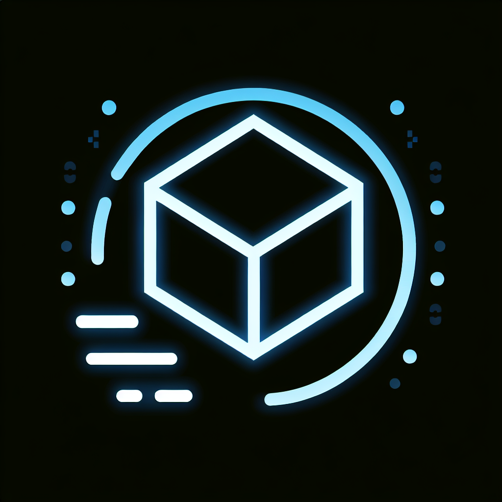

# 🎮 ARGames

<div align="center">
  
  
  [](https://reactjs.org/)
  [](https://threejs.org/)
  [](https://www.khronos.org/webgl/)
  [](https://www.typescriptlang.org/)
</div>

## 🎯 About The Project

ARGames is an immersive 3D multiplayer web game built with cutting-edge web technologies. Experience real-time ball movement and platform interactions in a stunning 3D environment, all running directly in your web browser.

### ✨ Key Features

- 🎲 Real-time 3D gameplay using Three.js
- 🌐 Multiplayer functionality via WebSocket
- 🎮 Responsive game controls
- 📱 Cross-platform compatibility
- 🎨 Modern React-based UI
- 🔄 Real-time physics and collision detection

## 🚀 Getting Started

### Prerequisites

- Node.js (v18 or higher)
- npm or yarn package manager

### Installation

1. Clone the repository
```bash
git clone https://github.com/amanrathore48/ARGames.git
cd ARGames
```

2. Install dependencies
```bash
npm install
# or
yarn install
```

3. Start the development server
```bash
npm run dev
# or
yarn dev
```

## 🎮 How to Play

1. Open your browser and navigate to `http://localhost:5000`
2. Use the following controls:
   - WASD or Arrow keys for movement
   - Space bar to jump
   - Mouse to look around
   - Click to interact with objects

## 🛠️ Built With

- [React](https://reactjs.org/) - UI Framework
- [Three.js](https://threejs.org/) - 3D Graphics Library
- [WebSocket](https://developer.mozilla.org/en-US/docs/Web/API/WebSocket) - Real-time Communication
- [TypeScript](https://www.typescriptlang.org/) - Programming Language
- [Vite](https://vitejs.dev/) - Build Tool

## 🤝 Contributing

Contributions are what make the open source community such an amazing place to learn, inspire, and create. Any contributions you make are **greatly appreciated**.

1. Fork the Project
2. Create your Feature Branch (`git checkout -b feature/AmazingFeature`)
3. Commit your Changes (`git commit -m 'Add some AmazingFeature'`)
4. Push to the Branch (`git push origin feature/AmazingFeature`)
5. Open a Pull Request

## 📝 License

Distributed under the MIT License. See `LICENSE` for more information.

## 📧 Contact

Aman Rathore - [@amanrathore48](https://github.com/amanrathore48)

Project Link: [https://github.com/amanrathore48/ARGames](https://github.com/amanrathore48/ARGames)
